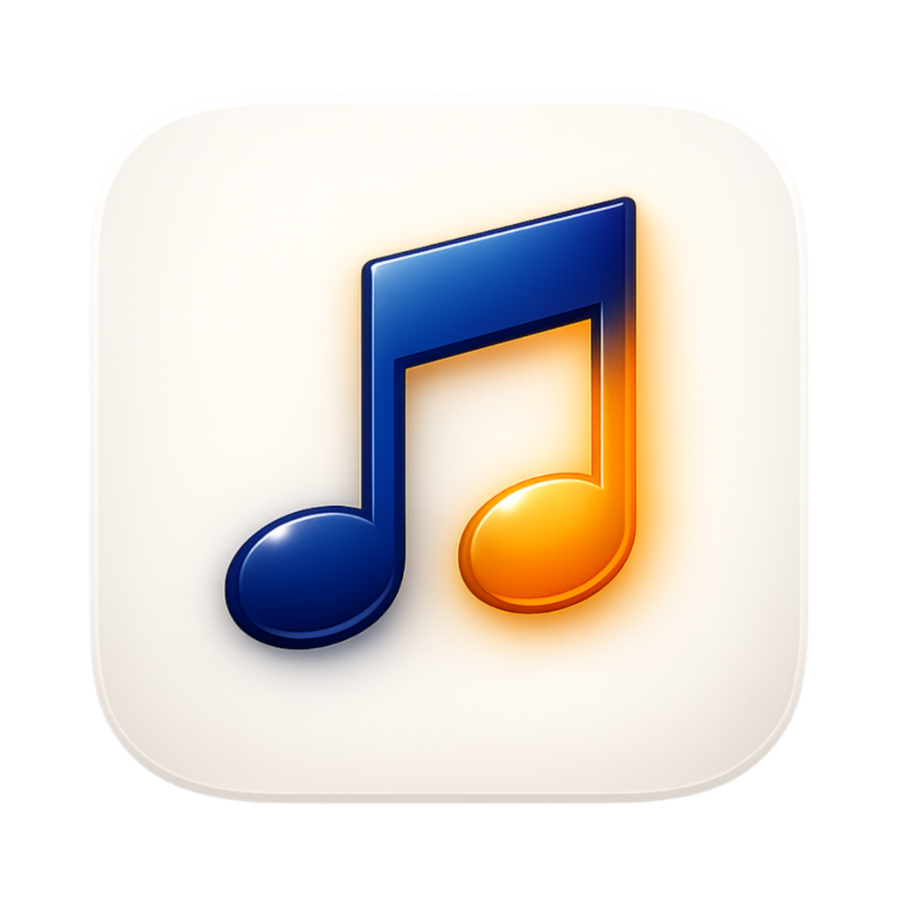
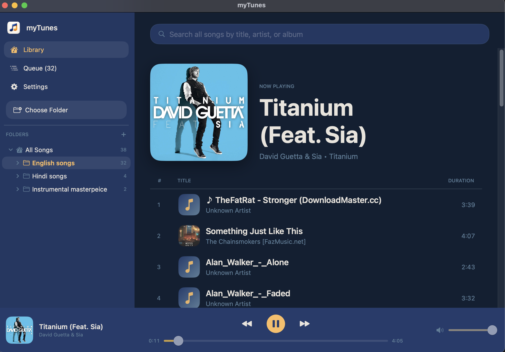
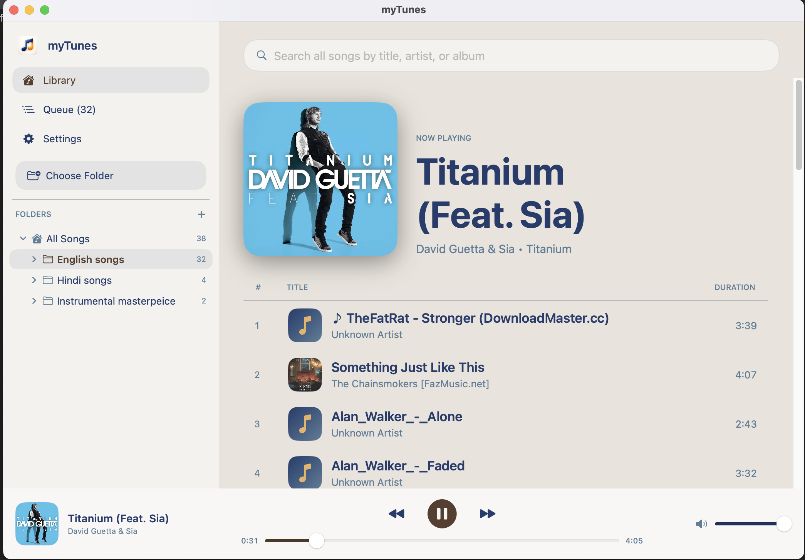
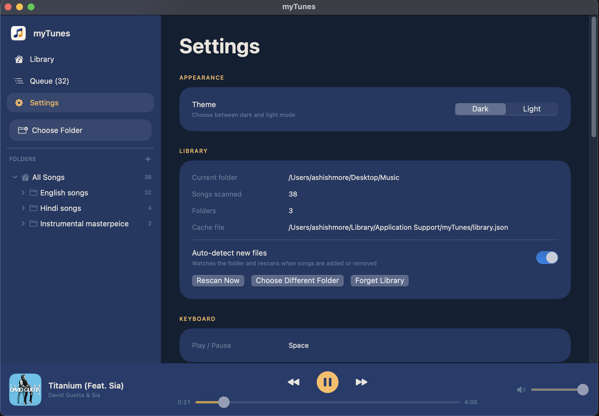

<div align="center">



# myTunes

### The music player your Mac always deserved.

**Beautiful. Native. Offline. Yours.**

*Point it at a folder. Hit play. That's it.*

</div>

---

## Why myTunes?

Streaming services watch what you listen to. Cloud players need an account, a subscription, and a stable connection. The default macOS music app has grown into a sprawling store with everything except a focus on **your music**.

**myTunes is the opposite of all that.**

It's a small, fast, beautifully native macOS player built around a simple idea: you already own music. Play it. No login. No network. No tracking. No "Apple ID required." Just a clean window, your folders, and the play button.

If you have a music collection sitting on your disk — albums you bought, mixes you made, podcasts you saved, recordings you produced — myTunes is the shortest distance between that folder and listening to it.

---

## A look inside

### Library view — dark mode (default)

<div align="center">
  
</div>

A focused three-pane layout: **sidebar** with your playlists and song counts, **now playing** with full album artwork front-and-center, and a **clean song list** with large, readable titles. The persistent player bar at the bottom keeps controls one click away — always.

### Library view — light mode

<div align="center">
  
</div>

Prefer a brighter workspace? Flip a single toggle and the entire app eases into a warm cream light theme. Same layout, same speed — just the look you want.

### Settings — everything in one place

<div align="center">
  
</div>

Appearance, library status, keyboard shortcuts, and audio — all on one calm page. Pick your folder, see exactly how many songs were scanned, toggle auto-detect of new files, and rescan on demand. No nested menus. No hidden preferences. No surprises.

---

## What makes it the best in its niche

| | myTunes | Default Music app | Streaming apps |
|---|:---:|:---:|:---:|
| Plays **your** files | Yes | Sort of | No |
| Works **offline** | Always | Sometimes | No |
| Account / login required | No | Yes | Yes |
| Network calls / telemetry | None | Many | Constant |
| Folders become playlists automatically | Yes | No | N/A |
| Native SwiftUI for macOS | Yes | Yes | Usually no (Electron) |
| Spacebar = play/pause | Yes | No | Varies |
| App size | Tiny | Hundreds of MB | Hundreds of MB |
| Cost | Free | "Free" | Subscription |

myTunes wins by **not trying to be everything**. It is a player, and only a player. That focus is why it loads instantly, looks gorgeous, and never gets in your way.

---

## Features at a glance

- **Folders become playlists, automatically.** Every subfolder inside the root you pick is a playlist. Drop a new folder of MP3s into your Music directory and it shows up — no tagging, no importing, no syncing.
- **Beautiful native UI.** Built with SwiftUI for macOS 13+. Buttery scrolling, real animations, system-quality typography, full Retina support.
- **Dark and light themes.** A modern navy-and-amber dark mode by default, plus a warm cream light mode. Switch any time.
- **Album artwork + ID3 tags.** Embedded cover art, song title, artist, and album are pulled straight from your files and displayed beautifully.
- **Real playback controls.** Play, pause, next, previous, seekable progress bar, smooth volume slider, automatic auto-advance through the queue.
- **Spacebar play/pause.** The shortcut you instinctively press. It works — and intelligently steps aside when you're typing in a text field.
- **Wide format support.** MP3, M4A, WAV, AAC, FLAC, AIFF, AIF — your collection, however it came.
- **Auto-detect new files.** Add an album to your folder while myTunes is open and it appears instantly. No "import" button required.
- **Library persistence.** Your folder, your playlists, your last-selected view — all remembered between launches.
- **Fast search.** A single search box across titles, artists, and albums.
- **100% offline. 100% private.** No accounts. No network. No analytics. Nothing leaves your Mac. Ever.

---

## Ridiculously easy to use

There is no onboarding flow. There is no tutorial. There is barely a learning curve. Here is the entire user manual:

1. **Open myTunes.**
2. **Click "Choose Folder"** and pick the directory where your music lives.
3. **Press play.**

That's it. Subfolders become playlists. Files become songs. Artwork appears. The spacebar pauses. Volume slides. The bottom bar shows what's playing. You already know how to use it.

---

## Get started

```bash
# Clone or download, then:
cd ~/Desktop/myTunes
./build_app.sh
open myTunes.app
```

**Requires:** macOS 13.0 (Ventura) or later.

After launch, click **Choose Folder** in the sidebar and pick the folder where your music lives. myTunes will scan it, build your playlists from the subfolders, and you're listening within seconds.

---

## Keyboard shortcuts

| Action | Shortcut |
|---|---|
| Play / Pause | `Space` |
| Next track | Click ⏭ or auto-advance |
| Previous track | Click ⏮ |
| Toggle theme | Settings → Appearance |

---

## Privacy promise

myTunes does **not**:

- connect to the internet
- require an account
- collect analytics or telemetry
- read anything outside the folder you choose
- upload, sync, or share your music

Your library cache lives at `~/Library/Application Support/myTunes/library.json` on your Mac — and nowhere else.

---

<div align="center">

### Your music. Your Mac. Your rules.

**myTunes**

</div>
